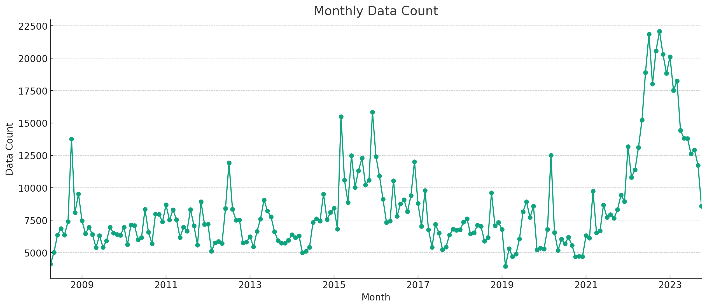
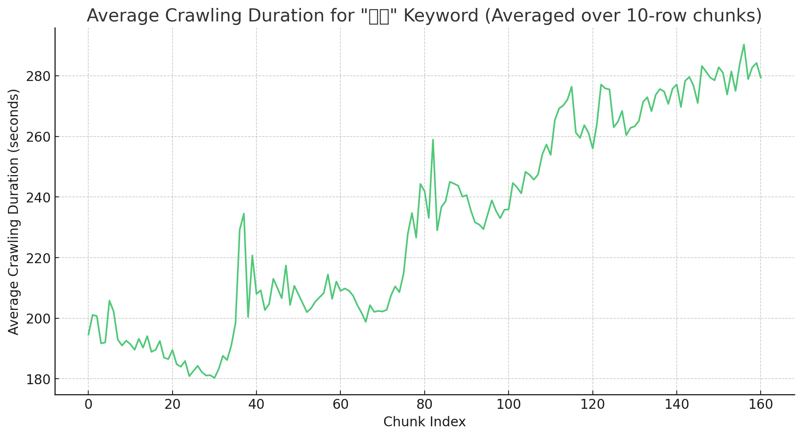

# 뉴스 text 추출 (Text Extraction : News Articles)
- 방법 : 검색 결과의 뉴스 text를 웹 크롤링 
- 수집기간 : 2008-04-10 ~ 2023-10-19
- 검색 플랫폼 : Naver
- 검색어 : 금리
- 사용 툴 : [Naver-News-Crawler](https://github.com/Kain7f1/Naver-News-Crawler)

---

### 1. url 크롤링

[Figure 1. 달 별 데이터의 양]

- 수집한 url 데이터 : 1,607,899개
- 소요된 시간 : 1,094,647초 (약 304 시간)

### 2. text 크롤링

[Figure 2. 크롤링에 걸린 시간 추이 (데이터 1000개 단위) ]

- 수집한 text 데이터 : 1,607,899개
- 소요된 시간 : 371,687초 (약 103 시간)

