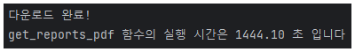

# 채권 분석 보고서 text 추출 (Text Extraction : Bond Analysts Reports)
  - 방법 : [네이버 증권](https://finance.naver.com/research/debenture_list.naver)에서 보고서 pdf 내려받기, pdf에서 text 추출
  - 수집기간 : 2008-04-10 ~ 2023-10-19

### 1. 보고서 pdf 내려받기
  
  - 방법 : 웹 크롤링
  - 결과 파일 : 채권분석보고서 pdf 파일 6124개 (4.28GB)
  - 저장 폴더명 : reports_pdf_files

### 2. pdf에서 text 추출
  
  - 추출한 데이터 : 6089개
  - 에러 발생 데이터 : 35개  
  - 추출하지 못한 데이터가 0.57% 있었지만, 이미 데이터는 충분하므로 진행한다.
  - 추출한 데이터 : 날짜, 채권분석보고서 text
  - text 추출에 걸린 시간 : 5851초
  - 결과 파일 : reports_text.csv (104 MB)