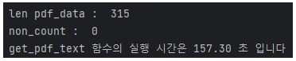

# 의사록 text 추출 (Text Extraction : MPB Minutes)
  - 방법 : [한국은행](https://www.bok.or.kr/portal/bbs/B0000245/list.do?menuNo=200761&pageIndex=1)에서 의사록 pdf 내려받기, pdf에서 text 추출
  - 수집기간 : 2008-04-10 ~ 2023-10-19

### 1. 의사록 pdf 내려받기
  - 방법 : 마우스 클릭
  - 크롤링을 사용하지 않은 이유 
    1. html 구조의 일관성이 없다. hwp 파일, pdf 파일 2종류가 있는데, 이 순서가 의사록마다 뒤죽박죽이다.
    2. 다운해야 하는 양이 많지 않다. (300개 정도)
    3. 코드 짜는 시간보다 손으로 클릭하는 시간이 짧을 것으로 판단하였다.
  - 결과 파일 : 의사록 pdf 파일 315개 (59.9MB)
  - 저장 폴더명 : minutes_pdf_files

### 2. pdf에서 text 추출
  
  - 데이터 수 : 315개
  - 추출한 데이터 : 날짜, 의사록 text
  - text 추출에 걸린 시간 : 157초
  - 결과 파일 : minutes_text.csv (13.0MB)

  